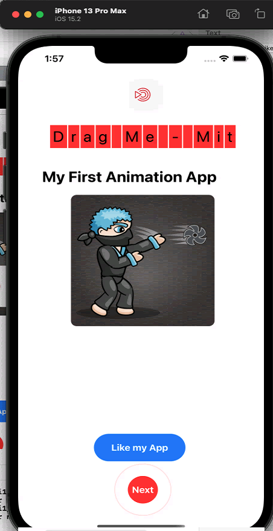
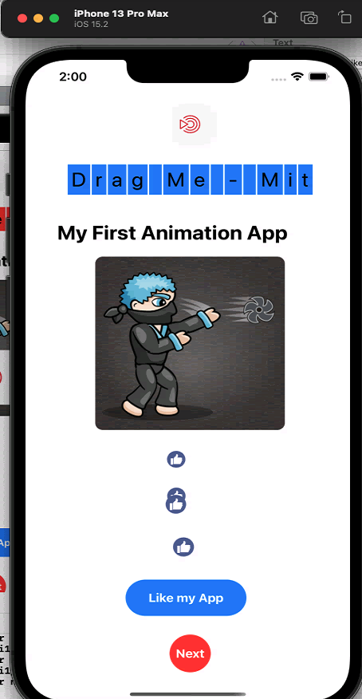
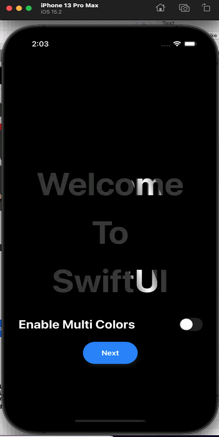
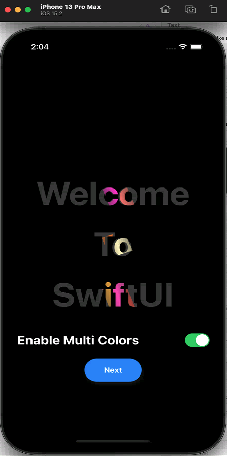
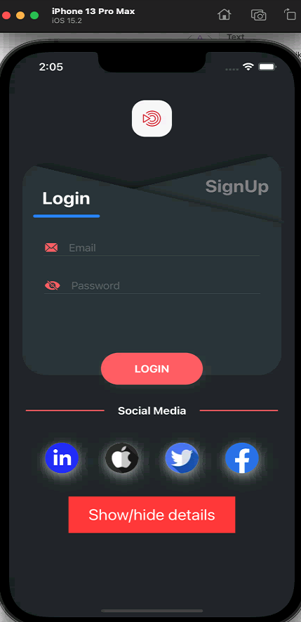
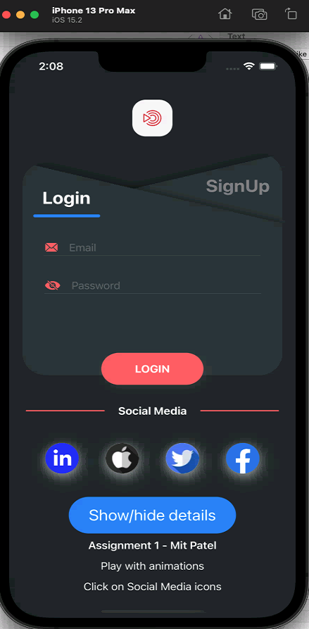
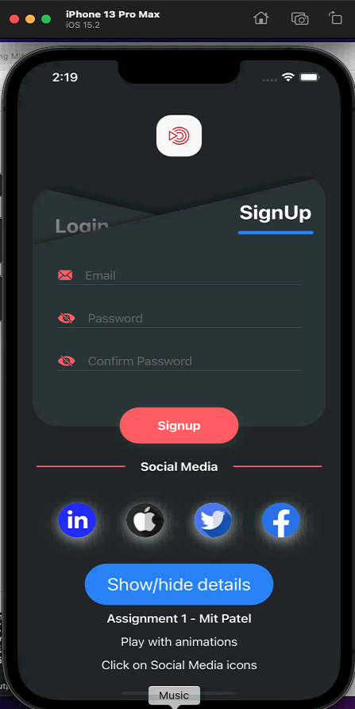

# Animations-MitPatel

## Create an App with Walkthrough and Login/Signup Screen With different animation
    >>> I would like to recommand you to use the iPhone 13 pro/max for testing or executing the app

+ This is the app with Splash Screen, Walkthrough pages and Login/Signup combine pages.

+ Initially, user will see the Splash Screen and after that person will appear with first walkthrough page.
  
 # 

+ After that if user drag the **dragme-mit** part, it will show the effect like snake and it will change the color of the text.
+ In the bottom, we have *like my app* button, so if user click on the button then it will starting popping out the mutliple likes.
+ Lastly, we have a next button, which is blinking continuously and spred out the red rings.
  
 # 

+ In the second walkthrough we have a text with toggle switch, which will show different colors on the text with animation.
 #   # 

+ After that, we have a login/signup screen, in which the bottom buttom will be drop down from the top.
 # 

+ If we click on the **show/hide details** button, then it will show diffrent text with different animation and I also put the delay in the aniamtion. So it will look properly.
+ The social media button will be flip on the click.
+ if we click on the login button, it will show the loading with the circle animation.
 # 

+ In the last, we have signup screen, if we click on the sigup part, it will display the signup page.
   # 